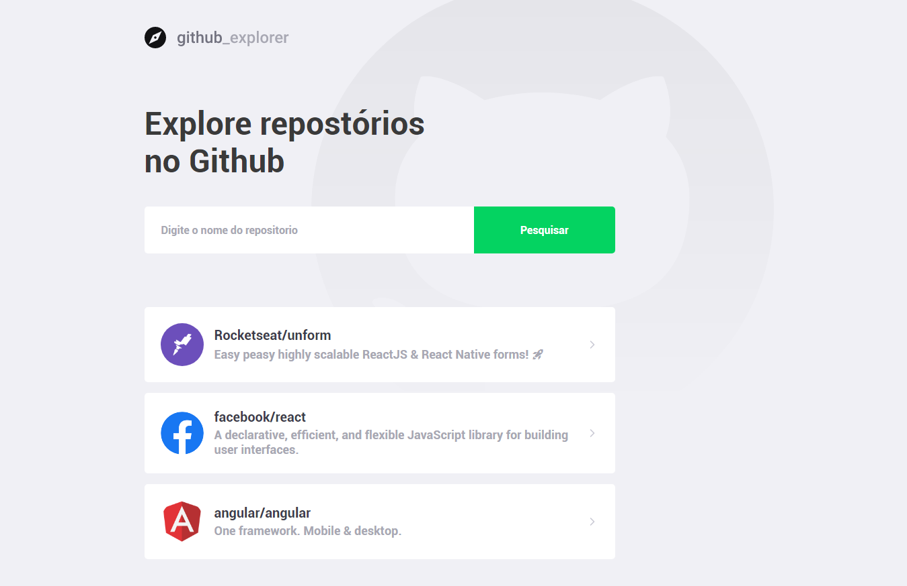
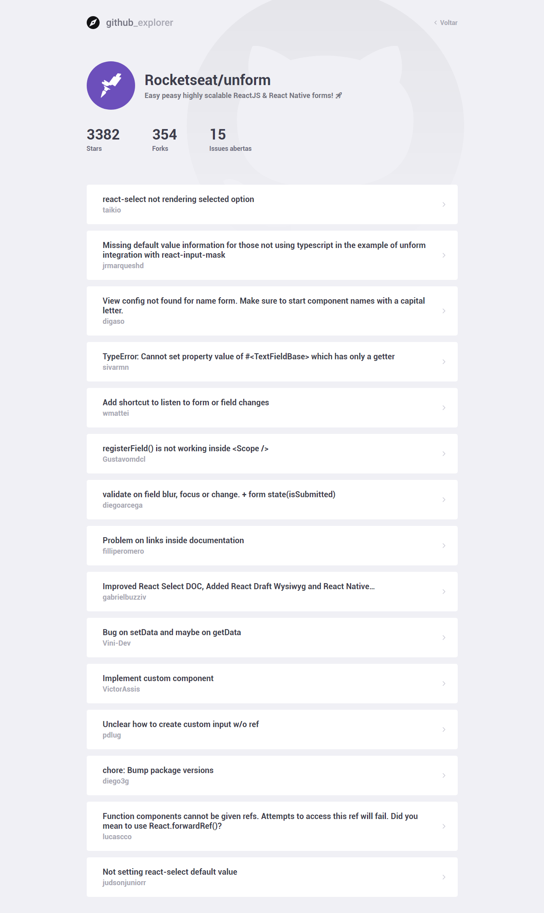

# Projeto Github Explorer realizado no Gostack! 

Com objetivo de consultar informações de repositórios do Github, utilizamos a api do próprio Github para consulta dos dados e issues.

Feito com ReactJS, o projeto utilizou também o conceito de Styled Components para estilização das telas.

# Página inicial:

# Página do Repositório e Issues:

